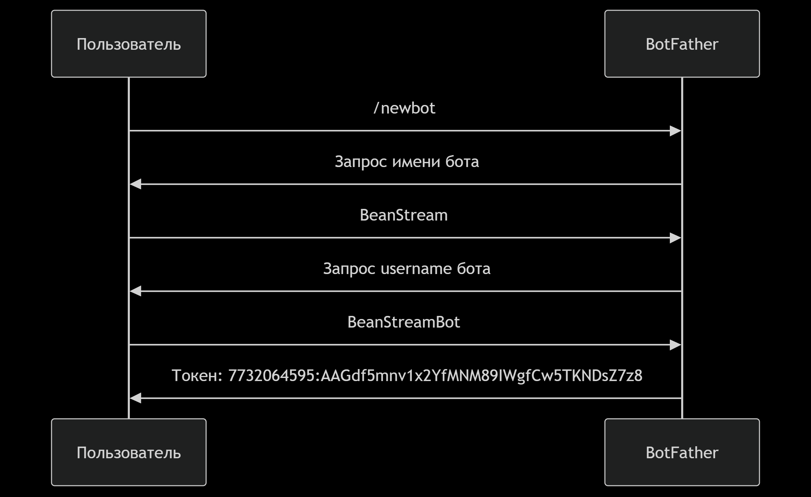
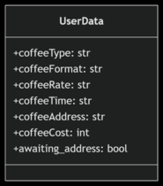
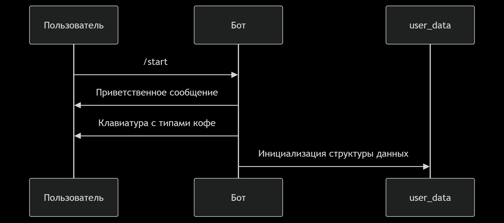
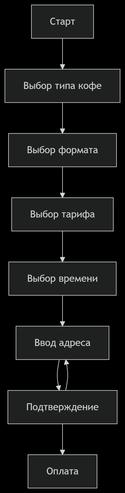

<strong><h1>Создание Telegram-бота для подписки на кофе (BeanStream)</h1></strong>\
В этом руководстве я подробно опишу процесс создания бота для оформления подписки на кофе в зёрнах с использованием библиотеки telebot.

📋 Содержание:\
1.Создание бота через @BotFather\
2.Установка необходимых библиотек\
3.Архитектура бота\
4.Пошаговая реализация\
5.Полный код бота\
6.Запуск бота

 <strong><h2>🤖Создание бота через @BotFather</h2></strong>\

<strong><h2>📦 Установка необходимых библиотек</h2></strong>

```
pip install pyTelegramBotAPI requests
```

<strong><h2>📐 Архитектура бота</h2></strong>
<h3>Общая схема работы</h3>


<h3>Структура данных пользователя</h3>



<strong><h2>🔧 Пошаговая реализация</h2></strong>
<h3>1. Инициализация бота</h3>

```
import telebot
from telebot import types

bot = telebot.TeleBot('YOUR_TOKEN')\
user_data = {}  # Словарь для хранения данных пользователей
```

<h3>2. Обработка команды /start</h3>

```
@bot.message_handler(commands=['start', 'hello'])
def send_welcome(message):
    # Создаем клавиатуру для выбора типа кофе
    markup = types.ReplyKeyboardMarkup(resize_keyboard=True, row_width=2)
    btn_arabica = types.KeyboardButton('Арабика')
    btn_robusta = types.KeyboardButton('Робуста')
    btn_blend = types.KeyboardButton('Смесь')
    markup.add(btn_arabica, btn_robusta, btn_blend)
    
    # Отправляем приветственное сообщение
    welcome_text = ""
Привет, добро пожаловать в BeanStream!
Давайте оформим вашу подписку на кофе.
Выберите сорт кофе:
""
    bot.send_message(message.chat.id, text=welcome_text, reply_markup=markup)
    
    # Инициализируем данные пользователя
    user_data[message.chat.id] = {
        'step': 'select_coffee_type',
        'coffee_type': None,
        'coffee_format': None,
        'tariff': None,
        'delivery_time': None,
        'address': None,
        'order_confirmed': False
    }
```



<h3>3. Основной процесс оформления заказа</h3>



<h3>4. Обработка выбора типа кофе</h3>

```
@bot.message_handler(func=lambda message: message.text in ['Арабика', 'Робуста', 'Смесь'])
def handle_coffee_type_selection(message):
    chat_id = message.chat.id
    user_data[chat_id]['coffee_type'] = message.text
    user_data[chat_id]['step'] = 'select_coffee_format'
    
    # Создаем клавиатуру для выбора формата кофе
    markup = types.ReplyKeyboardMarkup(resize_keyboard=True, row_width=2)
    btn_grains = types.KeyboardButton('В зёрнах')
    btn_ground = types.KeyboardButton('Молотый')
    markup.add(btn_grains, btn_ground)
    
    bot.send_message(chat_id, 'Отличный выбор! Теперь укажите формат кофе:', reply_markup=markup)
```

<h3>5. Обработка выбора формата кофе</h3>

```
@bot.message_handler(func=lambda message: message.text in ['В зёрнах', 'Молотый'])
def handle_coffee_format_selection(message):
    chat_id = message.chat.id
    user_data[chat_id]['coffee_format'] = message.text
    user_data[chat_id]['step'] = 'select_tariff'
    
    # Создаем клавиатуру для выбора тарифа
    markup = types.ReplyKeyboardMarkup(resize_keyboard=True, row_width=1)
    for tariff_id, tariff in COFFEE_TARIFFS.items():
        btn_text = f"{tariff['name']} - {tariff['price']} руб."
        markup.add(types.KeyboardButton(btn_text))
    
    bot.send_message(chat_id, 'Выберите подходящий тариф:', reply_markup=markup)
```

<h3>6. Обработка выбора тарифа</h3>

```
@bot.message_handler(func=lambda message: any(
    f"{tariff['name']} - {tariff['price']} руб." in message.text 
    for tariff in COFFEE_TARIFFS.values()
))
def handle_tariff_selection(message):
    chat_id = message.chat.id
    user_data[chat_id]['step'] = 'select_delivery_time'
    
    # Определяем выбранный тариф
    for tariff_id, tariff in COFFEE_TARIFFS.items():
        if f"{tariff['name']} - {tariff['price']} руб." in message.text:
            user_data[chat_id]['tariff'] = tariff_id
            user_data[chat_id]['tariff_name'] = tariff['name']
            user_data[chat_id]['price'] = tariff['price']
            break
    
    # Создаем клавиатуру для выбора времени доставки
    markup = types.ReplyKeyboardMarkup(resize_keyboard=True, row_width=3)
    for time in DELIVERY_TIMES:
        markup.add(types.KeyboardButton(time))
    
    bot.send_message(chat_id, 'Выберите удобное время доставки:', reply_markup=markup)
```

<h3>7. Обработка выбора времени доставки</h3>

```
@bot.message_handler(func=lambda message: message.text in DELIVERY_TIMES)
def handle_delivery_time_selection(message):
    chat_id = message.chat.id
    user_data[chat_id]['delivery_time'] = message.text
    user_data[chat_id]['step'] = 'enter_address'
    
    # Убираем клавиатуру для ввода адреса
    markup = types.ReplyKeyboardRemove()
    
    address_prompt = """
📍 Пожалуйста, введите адрес доставки.
Формат: Город, улица, дом, квартира (если есть)
Пример: Москва, ул. Ленина, 10, кв. 25
"""
    bot.send_message(chat_id, address_prompt, reply_markup=markup)
```

<h3>8. Обработка ввода адреса</h3>

```
@bot.message_handler(func=lambda message: 
    user_data.get(message.chat.id, {}).get('step') == 'enter_address')
def handle_address_input(message):
    chat_id = message.chat.id
    user_data[chat_id]['address'] = message.text
    user_data[chat_id]['step'] = 'confirm_order'
    
    # Формируем сводку заказа
    order_summary = f"""
☕️ Ваш заказ:
• Сорт: {user_data[chat_id]['coffee_type']}
• Формат: {user_data[chat_id]['coffee_format']}
• Тариф: {user_data[chat_id]['tariff_name']} - {user_data[chat_id]['price']} руб.
• Время доставки: {user_data[chat_id]['delivery_time']}
• Адрес: {user_data[chat_id]['address']}
"""
    # Создаем клавиатуру подтверждения
    markup = types.ReplyKeyboardMarkup(resize_keyboard=True, row_width=2)
    btn_confirm = types.KeyboardButton('✅ Подтвердить')
    btn_change = types.KeyboardButton('✏️ Изменить адрес')
    markup.add(btn_confirm, btn_change)
    
    bot.send_message(chat_id, order_summary, reply_markup=markup)
```

<h3>9. Подтверждение заказа</h3>

```
@bot.message_handler(func=lambda message: message.text in ['✅ Подтвердить', '✏️ Изменить адрес'])
def handle_order_confirmation(message):
    chat_id = message.chat.id
    
    if message.text == '✅ Подтвердить':
        user_data[chat_id]['order_confirmed'] = True
        user_data[chat_id]['step'] = 'completed'
        
        # Формируем сообщение с подтверждением
        confirmation_text = f"""
✅ Ваш заказ принят! Спасибо за подписку на BeanStream ☕️

Детали заказа:
Сумма к оплате: {user_data[chat_id]['price']} руб.
Следующая доставка: {user_data[chat_id]['delivery_time']}

Для оплаты перейдите по ссылке:
https://payment.example.com/order/{chat_id}
"""
        markup = types.ReplyKeyboardRemove()
        bot.send_message(chat_id, confirmation_text, reply_markup=markup)
        
        # Здесь можно добавить логику сохранения заказа в БД
        
    elif message.text == '✏️ Изменить адрес':
        user_data[chat_id]['step'] = 'enter_address'
        markup = types.ReplyKeyboardRemove()
        bot.send_message(chat_id, 'Введите новый адрес доставки:', reply_markup=markup)
```

<h3>10. Запуск бота</h3>

```
if __name__ == '__main__':
    print("Бот BeanStream запущен...")
    bot.infinity_polling()
```
